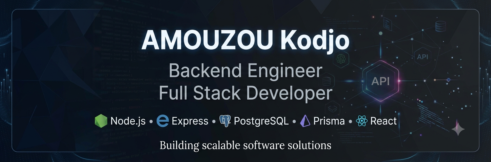

<!-- 
==================================================
README PROFIL GITHUB
Auteur : AMOUZOU Kodjo
==================================================
-->

<div align="center">



<br/>

# 👋 Bonjour, je suis AMOUZOU Kodjo

### 🚀 Backend Engineer | Full Stack Developer

<p>
Je conçois des applications web modernes, sécurisées et évolutives
avec une spécialisation dans les architectures backend professionnelles.
</p>

<br/>

<a href="https://github.com/AMOUZOU-Kodjo">

</a>

</div>


---

# 👨‍💻 À propos de moi

Je suis **AMOUZOU Kodjo**, développeur **Backend & Full Stack** passionné par la conception de solutions numériques robustes.

Mon objectif est de construire des applications capables de répondre aux exigences des environnements professionnels :

- performance ;
- sécurité ;
- maintenabilité ;
- évolutivité.


Je travaille principalement sur :

## ⚙️ Backend Engineering

- Node.js
- Express.js
- REST API
- Architecture MVC
- Architecture modulaire
- Authentification JWT
- RBAC (Role Based Access Control)
- Sécurité Web


## 🗄️ Data Engineering

- PostgreSQL
- SQL avancé
- Prisma ORM
- Modélisation relationnelle
- Optimisation des requêtes


## 🎨 Frontend Development

- React.js
- Vite
- Tailwind CSS
- Responsive Design
- UI moderne


## 🚀 DevOps & outils

- Git
- GitHub
- Docker
- CI/CD
- Linux
- Postman
- Swagger/OpenAPI


---

# 🏗️ Projets principaux

## 🌍 GlobalMarket

### Marketplace internationale multi-vendeurs

Une plateforme e-commerce complète permettant :

- gestion des vendeurs ;
- catalogue produits ;
- commandes ;
- paiements ;
- authentification ;
- administration.


Stack :

```
Node.js
Express
PostgreSQL
Prisma
JWT
React
Docker
```

Repository :

➡️ `github.com/AMOUZOU-Kodjo/globalmarket`


---


## 🏠 ChezMoiTogo

### Plateforme immobilière digitale

Solution destinée à faciliter :

- gestion immobilière ;
- suivi de projets ;
- communication avec la diaspora ;
- gestion documentaire.


Technologies :

```
React
Node.js
Express
MongoDB
Cloudinary
JWT
```


---


## 🚗 Garage Management System

### Application professionnelle de gestion automobile

Fonctionnalités :

- réception véhicules ;
- suivi réparations ;
- gestion mécaniciens ;
- espace directeur ;
- historique interventions.


Stack :

```
React
Node.js
Express
Database
REST API
```


---


## ⛪ Church Management System

Application de gestion numérique pour communauté religieuse.

Fonctionnalités :

- événements ;
- médias ;
- programmes ;
- administration ;
- utilisateurs.


---


# 🛠️ Technologies & outils


<div align="center">


## Backend


## Frontend


## Outils


</div>


---

# 📊 Statistiques GitHub


<div align="center">


<br/>


<br/>


</div>


---

# 🏆 Objectifs professionnels


Actuellement je développe mes compétences dans :


- Architecture Backend avancée
- Conception de systèmes distribués
- Microservices
- Cloud Computing
- DevOps
- Sécurité applicative
- Architecture logicielle


---

# 📚 Formation & partage


Je développe également des ressources pédagogiques autour de :

- JavaScript avancé
- Node.js Backend
- Express.js
- PostgreSQL
- Prisma ORM
- API REST professionnelles


---

# 💡 Ma philosophie


> "Un logiciel professionnel n'est pas seulement un programme qui fonctionne.
> C'est une solution pensée pour évoluer, être maintenue et créer de la valeur."


---

# 📫 Me contacter


<div align="center">


<a href="mailto:phipsipy@gmail.com">

</a>


<a href="www.linkedin.com/in/kodjo-amouzou-175268375">

</a>


<a href="https://github.com/AMOUZOU-Kodjo">

</a>


</div>


---

<div align="center">


### 🚀 Building the future with clean code and great ideas.


⭐ Merci de visiter mon profil !


</div>
